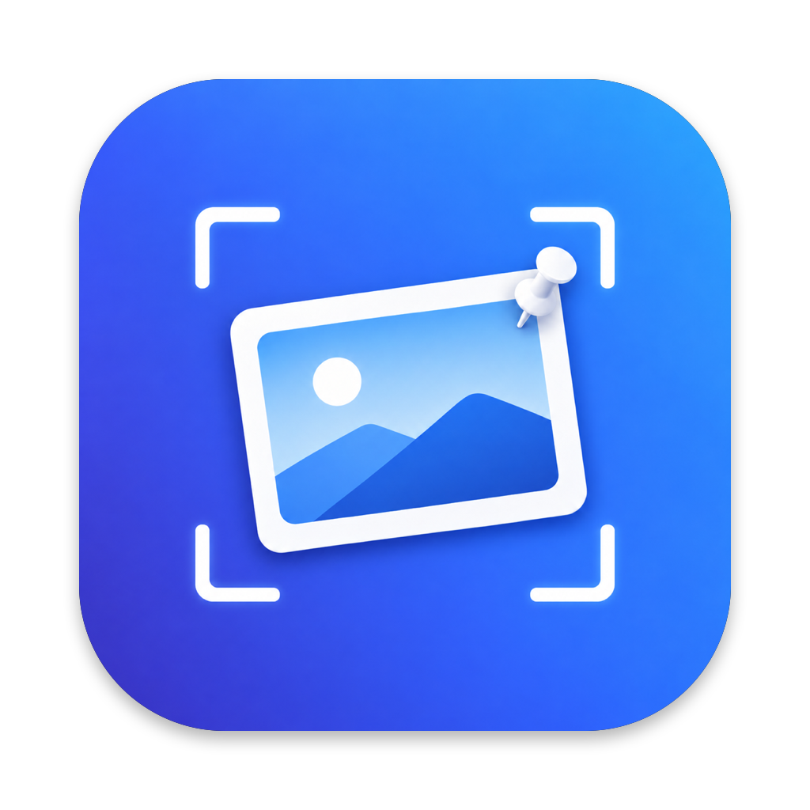

<p align="center">
  
</p>

# ScreenCap

**English** · [한국어](README.ko.md)

A CleanShot X–inspired screenshot and screen recording app for macOS, written in Swift (AppKit + SwiftUI) on top of ScreenCaptureKit.

## Features

- **Capture** — fullscreen, area (drag), or window (hover + click) from the menu bar or global hotkeys. The front app keeps focus, so windows look normal in the shot. Retina-aware, cursor optional.
- **All-in-One** — ⇧⌘8 opens one overlay with a mode toolbar (Area · Window · Fullscreen · Pin · Record · Text · Scroll). Switch with a click or the A/W/F/P/R/T/S keys (or 1–7); it remembers the last mode you used.
- **OCR** — ⇧⌘7 drags over any text (or clicks a window) and copies it as layout-preserving plain text. Korean, English, Japanese and Chinese are enabled; QR codes are decoded too, with an Open button for URLs.
- **Pin** — ⇧⌘4 grabs an area (or window) and leaves it floating above every app and Space, right where it was. Drag it aside, resize from the edges, scroll to change opacity, Esc or ✕ to close. Handy for keeping a chat or spec in view while you work. Lock a pin (⌘L or its menu) to make it click-through and immovable, ⌘+scroll or pinch to zoom 25–400%, double-click to reset, arrow keys to nudge, ⇧⌘9 to hide/show every pin. The menu bar's Pins submenu lists them, unlocks locked ones, and reopens the last closed pin.
- **Quick Access overlay** — captures stack up in the bottom-left corner. Hover for Copy / Save / Annotate / Pin / GIF, drag the thumbnail straight into another app, or let it auto-dismiss. While hovering a card, single keys act on it: C copy, S save, ⇧S save as, E annotate, P pin, G GIF, O open, F Finder, ⌫ dismiss, ⌘⌫ dismiss all.
- **Annotation editor** — arrow (straight or curved), line, rectangle, ellipse, pen, highlighter, text, pixelate, black-out, spotlight, crop, and numbered counters. A Background tool adds padding, rounded corners, shadow and solid/gradient/mesh backgrounds for share-ready images. "Detect sensitive text" runs OCR and proposes pixelation over emails, phone numbers, IPs and API keys. Undo/redo, move with the select tool, single-key tool shortcuts (A, L, R, O, P, H, T, B, K, N, S, C, V).
- **Screen recording** — record any area or window to H.264 `.mp4` (optionally with system audio), then convert to a looping GIF from Quick Access.

Default shortcuts (change them in Settings → Shortcuts):

| Action | Shortcut |
| --- | --- |
| Capture Fullscreen | ⇧⌘1 |
| Capture Area | ⇧⌘2 |
| Capture Window | ⇧⌘3 |
| Pin Area (floating reference) | ⇧⌘4 |
| Record Screen (start/stop) | ⇧⌘5 |
| Open Last Capture | ⇧⌘6 |
| Copy Text (OCR) | ⇧⌘7 |
| All-in-One | ⇧⌘8 |
| Hide/Show Pins | ⇧⌘9 |
| Scrolling Capture | ⇧⌘0 |
| Capture History | (menu bar; unassigned) |

⇧⌘3/4/5 are also macOS's built-in screenshot shortcuts, which take priority. Turn them off in System Settings → Keyboard → Keyboard Shortcuts → Screenshots (the Shortcuts tab in ScreenCap warns you and links there).

## Requirements

- macOS 15 (Sequoia) or later — uses `SCScreenshotManager` and `SCRecordingOutput`.
- Xcode 26, [XcodeGen](https://github.com/yonaskolb/XcodeGen) (`brew install xcodegen`).
- Screen Recording permission (System Settings → Privacy & Security → Screen & System Audio Recording). Grant it, then relaunch the app.

## Build & run

```sh
./scripts/run.sh          # xcodegen + xcodebuild (Debug) + launch
```

The default build is ad-hoc signed, so macOS may ask for Screen Recording permission again after each rebuild. To keep it, copy `scripts/local.env.example` to `scripts/local.env` and put your Apple Developer Team ID in it (the file is git-ignored; `scripts/build.sh` passes it to xcodebuild). In Xcode itself, pick your team in the target's Signing tab.

`./scripts/install.sh` builds a Release app, copies it to `/Applications` (so Spotlight and Launchpad can find it), and launches it from there. `scripts/build.sh` only builds; the `.app` lands in `build/Build/Products/Debug/`. To work in Xcode, run `xcodegen generate` and open `ScreenCap.xcodeproj` (it's git-ignored; `project.yml` is the source of truth).

Development flags:

```sh
ScreenCap.app/Contents/MacOS/ScreenCap --open-editor path/to/image.png   # open the annotation editor directly
ScreenCap.app/Contents/MacOS/ScreenCap --debug-overlay                    # show the selection overlay, print the result
```

## Project layout

```
ScreenCap/
  App/          entry point, app delegate, menu bar item, main menu
  Capture/      ScreenCaptureKit engine, window enumeration, selection overlay, coordinator, pin windows
  Recording/    SCStream recorder, on-screen recording controls, GIF export
  QuickAccess/  bottom-left thumbnail stack (NSPanel + SwiftUI)
  Editor/       annotation model, shared CG renderer, AppKit canvas, editor window
  Settings/     UserDefaults-backed preferences and the Settings window
  Hotkeys/      Carbon RegisterEventHotKey wrapper and recorder UI
  Support/      file store, clipboard, permissions, OCR, extensions
```

Design notes:

- Overlays and Quick Access are **non-activating `NSPanel`s**, so ScreenCap never steals focus and the app you're capturing doesn't dim.
- Every ScreenCap window is excluded from the `SCContentFilter`, so the overlay, frame, and recording controls never appear in the output.
- Annotations are rendered by one Core Graphics code path (`AnnotationRenderer`) for both the live canvas and the exported image, in y-down image-pixel coordinates.

## Releases

### Installing a release

1. Download `ScreenCap-<version>.dmg` from the [Releases page](https://github.com/kswift1/ScreenCap/releases) (a `.zip` of the same app and SHA-256 checksums are attached too).
2. Open the dmg and drag **ScreenCap** onto the **Applications** shortcut next to it, then eject the disk image.
3. Launch ScreenCap from Applications. Releases are signed with a Developer ID certificate and notarized by Apple, so Gatekeeper opens them without any right-click workaround. ScreenCap lives in the menu bar (there is no Dock icon).
4. On first capture, macOS asks for **Screen Recording** permission. Allow it in System Settings → Privacy & Security → Screen & System Audio Recording, then quit and relaunch ScreenCap. Recording with a microphone asks for Microphone permission the same way.

### Cutting a release (maintainers)

`scripts/release.sh` builds, signs, notarizes and packages a release in one go. It needs the Xcode command line tools, a **Developer ID Application** certificate in your keychain, and two keys in `scripts/local.env` (git-ignored; start from `scripts/local.env.example`):

| Key | Meaning |
| --- | --- |
| `DEVELOPMENT_TEAM` | Team ID that owns the Developer ID certificate (`security find-identity -v -p codesigning` lists it). |
| `NOTARY_PROFILE` | Name of a `notarytool` keychain profile, created once with `xcrun notarytool store-credentials "<name>" --apple-id … --team-id … --password <app-specific password>`. |

```sh
scripts/release.sh 1.2.0 --dry-run   # build + sign + zip + dmg only; no notarization, commit or tag
scripts/release.sh 1.2.0             # the real thing
```

The script validates the semver, sets `CFBundleShortVersionString` and bumps `CFBundleVersion` in `project.yml`, builds Release with the Developer ID identity, hardened runtime and a secure timestamp, zips the app (`ditto`), submits it with `notarytool --wait`, staples the ticket, builds a dmg (app + Applications symlink, volume "ScreenCap"), signs, notarizes and staples the dmg, and writes SHA-256 sums plus a `RELEASE_NOTES.md` skeleton (git log since the previous tag) into `dist/`. It then commits the version bump, creates the annotated tag `v<version>` (aborting if it already exists), and prints the `git push` and `gh release create … --notes-file dist/RELEASE_NOTES.md` commands for you to run after editing the notes. A real run refuses to start on a dirty working tree; `--dry-run` only warns and restores `project.yml` when it finishes. Normal `scripts/build.sh` / `run.sh` builds stay ad-hoc signed and are unaffected.

## License

MIT — see [LICENSE](LICENSE).
